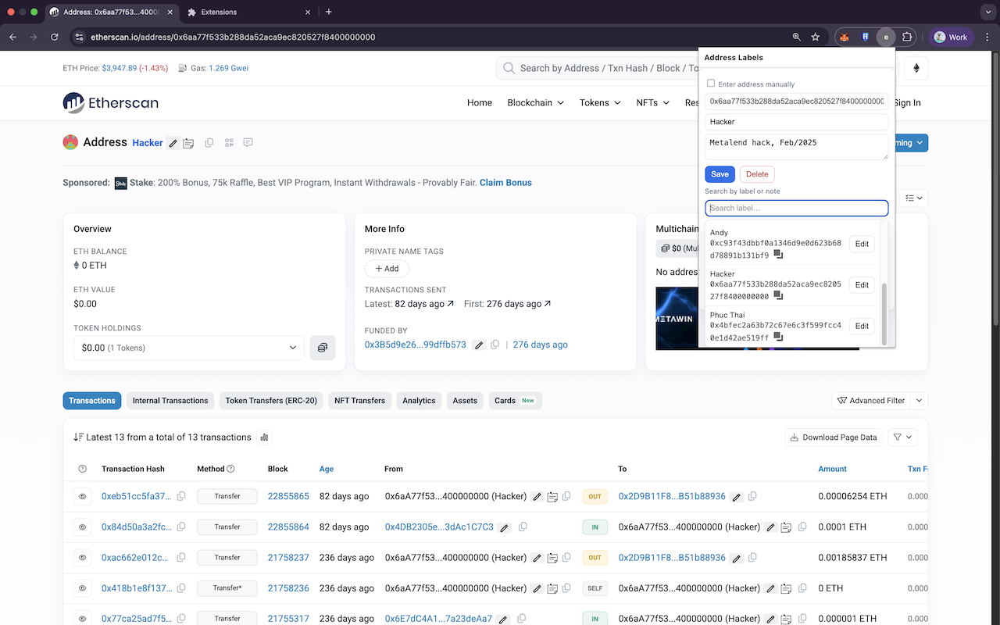
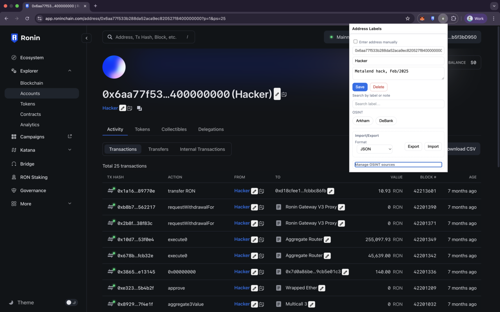

# explabel

Chrome extension to label blockchain addresses on Etherscan/BscScan/Arbiscan/PolygonScan/BaseScan with inline edit, notes, search, and OSINT quick links — all stored locally (no data leaves your browser).

Labels are shown inline on explorer pages with a small edit button and optional OSINT quick links. All data stays local in your browser profile.

## Disclaimer
This is a “vibe code” project: experimental, evolving, and provided as‑is with no warranties. Expect rough edges; use at your own discretion.

## Screenshots

Video demo: [this link](https://www.youtube.com/watch?v=qCwDk1VZpAA).

## Key Features
- Inline labeling on explorer pages
  - Replaces/augments addresses with your saved label
  - ✎ edit button next to each detected address
  - Minimal inline menu: “Edit label…” and OSINT quick links
- Popup for quick actions
  - Detects current tab’s address automatically
  - Save/Delete label for the current address
  - Import/Export labels (JSON or CSV)
- OSINT sources (configurable)
  - Defaults: Arkham, DeBank
  - Add your own by pasting a sample URL; the extension auto-detects where to insert `{}`
  - Quick-open OSINT from popup or inline menu
- Notes (display-only, non-intrusive)
  - 📝 icon appears when a note exists for the address
  - Hold Shift and hover the label/✎/📝 to see the note’s first line (tooltip)
- Local-only storage via `chrome.storage.local`

## Install (Load Unpacked)
1. Open Chrome → `chrome://extensions`
2. Enable “Developer mode” (top-right)
3. Click “Load unpacked” and select this project folder
4. Visit an address page on any supported explorer (e.g. `https://etherscan.io/address/0x…`)
5. Labels appear inline; click ✎ to edit, or use the popup for quick actions

## Usage
Inline on page
- Hover addresses; you’ll see your labels where available
- Click ✎ → Inline menu → “Edit label…” (prompt) or open in OSINT
- Notes tooltip: hold Shift and hover label/✎/📝 (first line shown, truncated)

Popup
- Shows detected address from the active tab (or toggle manual input)
- Save/Delete label
- OSINT quick link buttons (use current address)
- Import/Export: choose JSON or CSV
- OSINT Sources Manager: add/remove sites by name and sample URL

## OSINT Sources
- Default list: Arkham, DeBank
- Add custom sources by pasting any sample URL (with an address). The extension converts it to a pattern with `{}` placeholder automatically. Examples:
  - `https://intel.arkm.com/explorer/address/0xabc…` → `https://intel.arkm.com/explorer/address/{}`
  - `https://debank.com/profile/0xabc…` → `https://debank.com/profile/{}`
  - `…?address=0xabc…` → `…?address={}`

## Data Model (Storage)
- `labels` (in `chrome.storage.local`)
  - Shape: `{ "<address>": { "label": string, "updatedAt": number, "note"?: string } }`
  - Address is normalized lowercase `0x…`
- `osint_sources` (in `chrome.storage.local`)
  - Shape: `Array<{ name: string, pattern: string }>` where `pattern` contains `{}` placeholder

## Permissions & Content Scripts
- Permissions: `storage`, `activeTab`, `tabs`, `scripting`
- Host permissions: Etherscan/BscScan/Arbiscan/PolygonScan/BaseScan/Ronin domains (see `manifest.json`)
- Content scripts: `utils.js`, `content.js` run on supported explorers to render labels, ✎, OSINT menu, and notes tooltip

## Privacy
- No external services; data never leaves your browser
- Removing the extension deletes its local storage

## Troubleshooting
- Not seeing labels? Refresh the page after saving a label
- Verify the site is one of the allowed hosts in `manifest.json`
- For OSINT links, ensure the address is valid (`0x` + 40 hex)
- Notes are display-only; if you already have a `note` saved for an address it will show via Shift-hover

## File Overview
- `manifest.json` — MV3 manifest, permissions, content scripts, host list
- `utils.js` — shared helpers (address parsing/normalization, OSINT pattern building)
- `content.js` — in-page labeling, ✎ edit menu, OSINT integration, Shift-hover notes tooltip
- `popup.html` / `popup.js` — popup UI for labeling, OSINT buttons, import/export, OSINT sources manager

## Roadmap
- Note editor (popover from ✎)
- Additional explorer presets and source packs
- Optional sync strategy (manual export/import or cloud)
